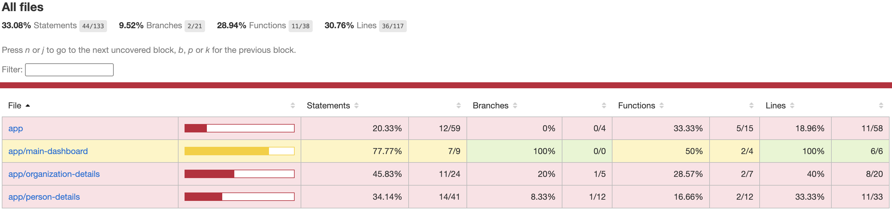

# Analyse

## Analyse de l'application FRONT

- L'application tourne sous **Angular 17.3.7**.
- Les tests sont écrits via le framework **Jasmine 5.1**.
- La version de **TypeScript** utilisée est **5.4.2**.

Concernant la version d'Angular, la 17 n'est plus LTS si on se réfère à ce lien : https://angular.dev/reference/releases  

Pour la partie CI/CD, il faudra faire un choix : 
- faire les mises à jour concernant la version d'Angular pour utiliser les bonnes images de Node
- ne pas faire les mises à jour et s'appuyer sur le tableau suivant pour les images docker : 

| Angular   | Node.js                              | TypeScript          | RxJS                |
| --------- | ------------------------------------ | ------------------- | ------------------- |
| 17.3.x    | ^18.13.0 \|\| ^20.9.0               | >=5.2.0 <5.5.0      | ^6.5.3 \|\| ^7.4.0 |

## Tests 

- Les outputs des tests exécutés par Jasmine seront stockés dans `./coverage/microcrm`.

Pour permettre l'exploitation des tests par SonarQube il faut ajuster la configuration de **karma** pour ajouter le reporter :  

```js
{ type: 'lcovonly', file: 'lcov.info' }
```

### Tests existant

Pour exécuter les tests de l'application Angular : 

```bash
cd front/
npm run test
```

Un total de 8 tests unitaires seront exécutés.


Pour générer le test coverage de l'application Angular : 
```bash
cd front/
npm run test -- --code-coverage
```


#### Components

Le `app.component` est testé à l'aide de 3 tests :
- should create the app
- should have the 'MicroCRM' title
- should render title

Le `person-details` est testé à l'aide d'un test :
- should create

Le `organization-details` est testé à l'aide d'un test :
- should create

Le `main-dashboard` est testé à l'aide d'un test : 
- should create

#### Services

Le `person.service` est testé à l'aide d'un test : 
- should create

Le `organization.service` est testé à l'aide d'un test : 
- should be created

## Les services

L'application possède 2 services. Un premier service concernant les `person` et un deuxième service concernant les 
`organization`.  

Les services implémentes l'URL du backend à l'aide du fichier `src/app/config.ts`. 

```ts
export const API_BASE_URL = "http://localhost:8080"
```

⚠️ Recommandation : externaliser cette URL via une variable d'environnement injectée au build ou au runtime, 
pour permettre la conteneurisation et le déploiement multi-environnements.


### Person

Une personne est schématisée à l'aide de cette interface : 

```ts
export interface Person {
    id?: number
    firstName: string
    lastName: string
    email: string
    phone: string
    bio: string
    createdAt: Date
    updatedAt?: Date
    organizations: Organization[];
}
```

Le service person permet de : 
- créer une nouvelle `person` en base de donnée
- supprimer une `person` à partir de l'ID
- rechercher une `person` à l'aide de son ID
- rechercher une `person` à l'aide de l'ID de l'`organization`
- récupérer toutes les `persons` de la base de données

### Organization

Une organisation est schématisée à l'aide de cette interface : 

```ts
export interface Organization {
    id?: number
    name: string
    createdAt: Date
    updatedAt?: Date

    persons: Person[]
}
```

Le service organization permet de : 
- crée une nouvelle organisation
- supprimer une organisation à l'aide de son ID
- rechercher l'organisation d'une personne via l'ID de la personne
- recherche une organisation par son ID
- récupérer toutes les organisations
- ajouter une personne à une organisation à l'aide de l'ID de l'organisation et l'ID de la personne
- retirer une personne d'une organisation à l'aide de l'ID de l'organisation et l'ID de la personne


## Les Pages

L'application contient 3 pages : 
- main-dashboard
- person-detail
- organization-detail

```ts
export const routes: Routes = [
    { path: '', component: MainDashboardComponent },
    { path: 'persons/:personId', component: PersonDetailsComponent },
    { path: 'organizations/:orgId', component: OrganizationDetailsComponent },
    { path: '**', redirectTo: '' }
];
```

## Synthèse Front

- Image Docker à utiliser : **Node 20 LTS** (Alpine pour la légèreté)
- Étapes CI : `npm ci` → `npm run test -- --code-coverage` → `npm run build`
- Artefacts : `dist/microcrm/` (build) et `coverage/microcrm/lcov.info` (Sonar)
- Variables d'environnement : URL du back à externaliser
- Dette technique identifiée : pas de lint, Angular 17 hors LTS, faible coverage