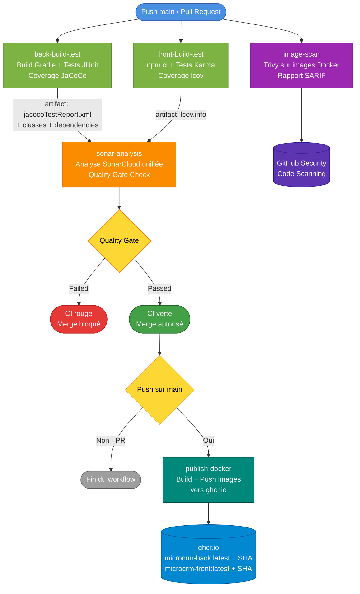

## 1. Plan CI/CD

Ce document décrit l'architecture du pipeline d'Intégration Continue mise en
place pour le projet MicroCRM, ainsi que les choix techniques structurants.

### 1.1 Vue d'ensemble du pipeline

Le workflow `ci.yml` est déclenché sur deux événements :
- `push` sur la branche `main`
- `pull_request` vers `main` (événements `opened`, `synchronize`, `reopened`)

Il est composé de **5 jobs** organisés en deux phases :

| Phase | Job | Rôle |
| ----- | --- | ---- |
| **CI** | `back-build-test` | Compile le JAR Spring Boot, exécute les tests JUnit, génère le rapport JaCoCo |
| **CI** | `front-build-test` | Installe les dépendances npm, exécute les tests Karma, génère le rapport lcov |
| **CI** | `image-scan` | Scan des images Docker via Trivy, remonte les CVE dans GitHub Security |
| **CI** | `sonar-analysis` | Récupère les rapports via artifacts, lance une analyse SonarCloud unifiée, vérifie le Quality Gate |
| **CD** | `publish-docker` | Build et publie les images Docker sur ghcr.io (uniquement sur push main) |

Le diagramme suivant illustre l'enchaînement :



### 1.2 Stratégie de branches : GitHub Flow

Le projet suit la stratégie **GitHub Flow** :
- `main` est la seule branche long-lived
- Toutes les fonctionnalités sont développées sur des branches courtes
  (`feature/*`, `fix/*`) qui partent de `main`
- L'intégration se fait via Pull Request vers `main`

> Note : initialement, le projet a été démarré avec une stratégie type
> Git Flow simplifié (`main` + `develop`). La migration vers GitHub Flow a été
> motivée par deux constats : (1) une simplification utile pour un projet de
> cette taille, (2) la limitation du plan SonarCloud gratuit qui n'analyse
> pas les branches long-lived autres que la branche principale, ce qui
> compliquait le pipeline pour `develop`.

### 1.3 Analyse SonarCloud unifiée via artifacts

#### Le problème

Avec deux jobs envoyant chacun leur analyse à SonarCloud sur la même
`projectKey`, **chaque analyse écrase la précédente**. SonarCloud traite
chaque analyse comme un snapshot complet du projet, pas comme un ajout
incrémental.

#### La solution retenue

Une **analyse unique** dans un job dédié (`sonar-analysis`) qui :

1. Attend la fin des jobs `back-build-test` et `front-build-test` (`needs:`)
2. Récupère leurs artifacts via `actions/download-artifact` :
    - `jacocoTestReport.xml` (back)
    - `lcov.info` (front)
    - `back/build/classes` et `back/build/dependencies` (back, pour analyse précise)
3. Lance **une seule analyse** combinant front + back via
   `SonarSource/sonarqube-scan-action`

Cette approche garantit une vue unifiée du projet sur le dashboard
SonarCloud (Java + TypeScript dans le même projet, coverage globale
cohérente).

### 1.4 Garde-fou Quality Gate

#### Le constat initial

Sans configuration spécifique, la CI passait verte même quand SonarCloud
signalait un Quality Gate KO. Le scan retournait "OK" dès que les données
étaient envoyées, indépendamment du résultat de l'analyse côté SonarCloud.

#### La correction

Ajout d'un step `SonarSource/sonarqube-quality-gate-action` après le scan,
qui :
- Polle SonarCloud pour récupérer le statut du Quality Gate
- Fait **échouer le job** si le Quality Gate est KO
- Logue un message explicite dans les logs GitHub Actions

Combiné avec la **branch protection** sur `main` qui exige tous les checks
verts pour autoriser un merge, cela garantit qu'aucun code dégradant la
qualité ne peut être intégré sans revue.

### 1.5 Scan de sécurité des images Docker (Trivy)

Le job `image-scan` complète l'analyse SonarCloud en couvrant un angle
différent de la sécurité : les **CVE connues dans les dépendances système**
des images Docker (paquets Alpine, JRE, Tomcat embarqué, etc.).

Le job tourne **en parallèle** des autres jobs CI (pas de `needs:`) pour
ne pas allonger la durée totale du pipeline. Il :

1. Build les images `back` et `front` via le Dockerfile multi-stage
2. Lance Trivy sur chaque image avec sévérité `CRITICAL,HIGH`
3. Génère un rapport au format **SARIF**
4. Upload le SARIF vers l'onglet **GitHub Security → Code Scanning**

Mode actuel : **informatif** (`exit-code: 0`). Le job ne fait pas échouer
la CI sur détection de vulnérabilité, le temps que les CVE existantes
soient triées et acknowledgées. À terme, le mode bloquant sera activé
sur les CVE `CRITICAL` introduites par du nouveau code.

> Le détail du choix de version (`v0.36.0` post-incident CVE-2026-33634)
> et l'analyse des vulnérabilités détectées sont documentés dans
> `plan_security.md` (sections 1.4 et 1.5).

### 1.6 Optimisations de performance

Plusieurs caches sont mis en place pour réduire le temps d'exécution du
pipeline :

| Cache               | Contenu                              | Bénéfice approximatif |
| ------------------- | ------------------------------------ | --------------------- |
| Gradle              | Dépendances Maven Central téléchargées| ~30s économisées      |
| SonarCloud packages | Plugins et règles SonarCloud         | ~10s économisées      |
| npm                 | `node_modules` via `setup-node`      | ~20s économisées      |

Au premier passage, la CI prend environ 2-3 minutes. Avec les caches
chauds, elle descend à 1-2 minutes.

### 1.7 Sécurité de la chaîne d'approvisionnement

#### Pinning par hash de commit

Toutes les actions GitHub utilisées dans le workflow sont référencées par
leur **SHA de commit** plutôt que par leur tag de version (`@v4`, `@latest`).

```yaml
uses: actions/checkout@34e114876b0b11c390a56381ad16ebd13914f8d5 # v4.3.1
```

Ce choix protège contre :
- La republication d'un tag pointant vers du code malveillant
- Les modifications silencieuses de versions sur un tag flottant

Le commentaire qui suit chaque hash indique la version humaine
correspondante pour faciliter les mises à jour ultérieures.

> Référentiel : OWASP Top 10:2025 — A03 Software Supply Chain Failures.

#### Gestion des secrets

Le `SONAR_TOKEN` est stocké dans les **GitHub Secrets** et référencé via
`${{ secrets.SONAR_TOKEN }}` dans le workflow. Aucun secret n'est jamais
écrit en clair dans :
- Le code source
- Les fichiers de configuration (`build.gradle`, `karma.conf.js`)
- Les Dockerfiles
- Les images Docker produites

### 1.8 Configuration Gradle pour Sonar

#### Plugin et coverage

Le `back/build.gradle` intègre :
- Le plugin `jacoco` pour générer le rapport de coverage XML attendu par
  SonarCloud
- Le plugin `org.sonarqube` pour permettre des analyses manuelles locales
  (`./gradlew sonar`) en cas de besoin de debug

#### Tâche `copyDependencies`

Une tâche Gradle custom a été ajoutée pour exporter toutes les
dépendances runtime dans `back/build/dependencies/` :

```gradle
task copyDependencies(type: Copy) {
    from configurations.runtimeClasspath
    into "$buildDir/dependencies"
}
```

Cette tâche est invoquée dans le job `back-build-test` et son résultat
est uploadé en artifact. Sonar utilise ensuite ces JARs via la propriété
`sonar.java.libraries=back/build/dependencies/*.jar` pour fournir une
**analyse statique plus précise** (résolution des types tiers, règles
inter-procédurales fines).

Sans cette tâche, SonarCloud émettait l'avertissement :
> Dependencies/libraries were not provided for analysis of SOURCE files.

### 1.9 Configuration Karma pour Sonar

Le `front/karma.conf.js` a été adapté pour générer le format de coverage
attendu par SonarCloud :

```javascript
coverageReporter: {
  dir: require("path").join(__dirname, "./coverage/microcrm"),
  subdir: ".",
  reporters: [
    { type: "html" },                              // rapport visuel local
    { type: "lcovonly", file: "lcov.info" },       // pour SonarCloud
    { type: "text-summary" }                       // résumé en console
  ]
}
```

Le format `lcovonly` est le seul exploité par SonarCloud, les deux autres
sont conservés pour le confort de développement.

### 1.10 Branch protection

La branche `main` est protégée avec les règles suivantes :
- Pull Request obligatoire avant merge
- Status checks requis (tous verts) :
    - `CI / Back - Build & test`
    - `CI / Front - Build & test`
    - `CI / SonarQube Analysis`
    - `SonarCloud Code Analysis` (commentaire automatique du bot)
- Branche cible à jour avec `main` avant merge
- Contournements admin désactivés

Ces règles garantissent que le Quality Gate et les tests sont
**effectivement bloquants**, et pas seulement informatifs.

### 1.11 Phase CD : publication automatique des images Docker

Après la validation CI complète (Quality Gate Sonar passé + tous les
checks verts), un dernier job `publish-docker` s'exécute **uniquement
sur push `main`** pour publier les images Docker sur GitHub Container
Registry.

#### Conditions d'exécution

```yaml
needs: [back-build-test, front-build-test, sonar-analysis, image-scan]
if: github.event_name == 'push' && github.ref == 'refs/heads/main'
```

Cette double condition garantit qu'aucune image dégradée ne se retrouve
dans le registre :
- Tous les jobs CI doivent être verts (`needs:`)
- Le déclenchement doit être un push sur `main` (pas une PR)

#### Stratégie de tags

Chaque image est publiée avec **deux tags simultanés** :

| Tag | Usage |
| --- | ----- |
| `latest` | Dernière version stable, pour les déploiements continus |
| `<sha_court>` | Ex. `2c4b0e2`, pour la traçabilité et le rollback |

Le SHA court est calculé via `git rev-parse --short HEAD`. Il correspond
au commit de merge sur `main`, ce qui garantit que chaque tag pointe vers
**un commit existant** sur la branche.

#### Authentification ghcr.io

L'authentification utilise le `GITHUB_TOKEN` automatique fourni par
GitHub Actions, avec la permission `packages: write` déclarée au niveau
du job. Aucun secret manuel à configurer.

#### Conversion lowercase du nom de propriétaire

ghcr.io exige que les noms de packages soient en **minuscules**, ce
qui n'est pas le cas par défaut du nom de propriétaire GitHub
(`LaurentGourouvin`). Une étape de conversion via `tr` est appliquée
en début de job :

```yaml
- name: Set lowercase repository owner
  run: |
    echo "REPO_OWNER_LOWER=$(echo ${{ github.repository_owner }} | tr '[:upper:]' '[:lower:]')" >> $GITHUB_ENV
```

La variable `${{ env.REPO_OWNER_LOWER }}` est ensuite utilisée dans tous
les tags d'images.

#### Pourquoi pas sur les Pull Requests

Publier depuis une PR pollurait le registre avec des images intermédiaires
qui n'ont pas vocation à être déployées. La publication n'a lieu qu'**après
le merge**, sur le commit final de `main`, pour garantir que :
- L'image publiée correspond exactement au code testé sur main
- Le tag SHA pointe vers un commit qui existe réellement sur la branche

#### Limites de la phase CD

Cette mission cible la **publication d'images** comme étape de CD, pas
le **déploiement effectif** sur un environnement cible. La suite logique
(pull et démarrage automatisés sur un serveur) sort du périmètre :

- **Déploiement manuel** : un opérateur peut pull et démarrer les images
- **Watchtower / Argo CD / Flux** : surveillance automatique du registre
- **Plateforme PaaS** : Render, Railway, Fly.io détectent les nouvelles
  images et redéploient

Ces options sont mentionnées dans le `plan_conteneurisation.md` comme
évolutions possibles.

### 1.12 Synthèse des commandes du pipeline

| Commande | Objectif | Où définie | Quand exécutée |
| -------- | -------- | ---------- | -------------- |
| `./gradlew build jacocoTestReport copyDependencies` | Compile, teste, génère coverage et exporte dépendances | `back/build.gradle` + `ci.yml` | À chaque push/PR (CI) |
| `npm ci` | Installe les dépendances front (build reproductible) | `front/package.json` + `ci.yml` | À chaque push/PR (CI) |
| `npm run test -- --code-coverage --watch=false --browsers=ChromeHeadlessNoSandbox` | Tests Karma headless avec coverage | `front/package.json` + `ci.yml` | À chaque push/PR (CI) |
| `docker build --target back -t microcrm-back:scan .` | Build image back pour scan | `ci.yml` (job image-scan) | À chaque push/PR (CI) |
| `docker build --target front -t microcrm-front:scan .` | Build image front pour scan | `ci.yml` (job image-scan) | À chaque push/PR (CI) |
| `git rev-parse --short HEAD` | Calcule le SHA court du commit pour tagger les images | `ci.yml` (job publish-docker) | Push main uniquement (CD) |
| Build + push images via `docker/build-push-action` | Build et publie les images sur ghcr.io | `ci.yml` (job publish-docker) | Push main uniquement (CD) |

## Ressources

- https://docs.github.com/en/actions/reference/workflow-syntax-for-github-actions
- https://docs.sonarsource.com/sonarqube-cloud/analyzing-source-code/scanners/sonarscanner-for-gradle
- https://github.com/SonarSource/sonarqube-quality-gate-action
- https://docs.github.com/en/actions/security-guides/security-hardening-for-github-actions