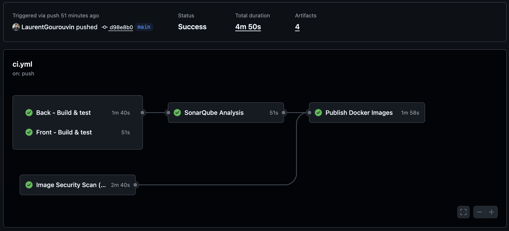
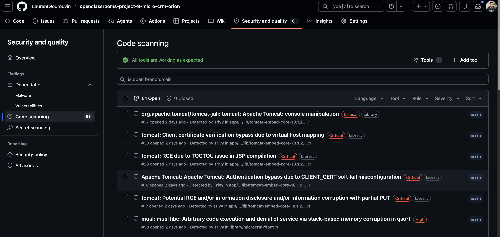
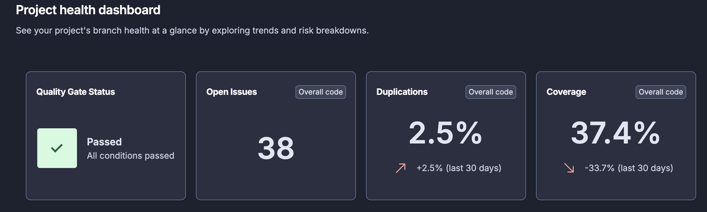
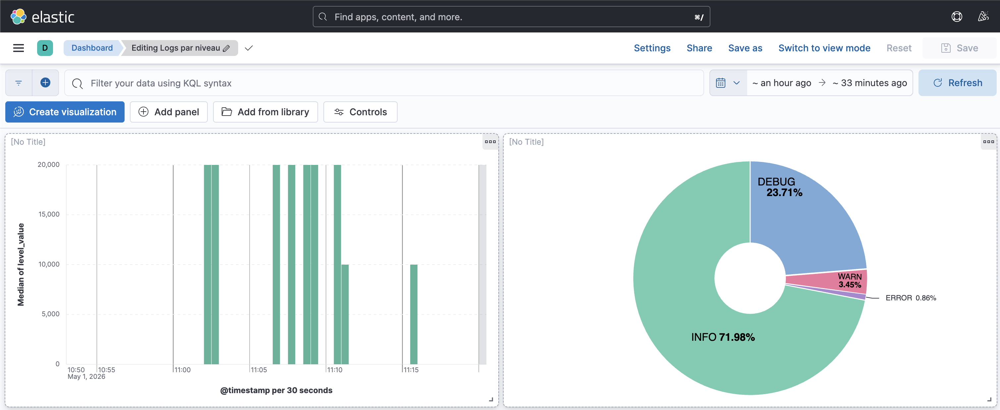

## 2. Métriques DORA et KPI

### 2.1 Contexte de mesure

Les métriques ont été collectées sur la période du **28 avril au 1er mai 2026**
(4 jours), correspondant à la phase de mise en place du pipeline CI/CD.

> ⚠️ Cette période correspond à la phase d'industrialisation du pipeline.
> La majorité des runs reflètent des ajustements techniques (configuration,
> Dockerfile, workflows) plutôt que des livraisons de fonctionnalités.
> Les valeurs observées sont donc à interpréter comme des indicateurs
> de référence initiaux, et non comme des métriques de production stabilisées.

**Sources de données** :
- GitHub Actions (historique des workflows)
- SonarCloud (qualité et coverage)
- GitHub Security (résultats Trivy)
- Stack ELK (logs applicatifs centralisés)

---

### 2.2 Métriques DORA

#### Lead Time for Changes

**Définition** : temps entre le premier commit d'un changement et sa mise
en production.

**Valeur observée** : **~4 minutes 23 secondes**

Ce délai correspond à la durée totale du pipeline CI/CD. Dès qu'un commit
est mergé sur `main`, le pipeline s'exécute automatiquement et les images
Docker sont publiées sur ghcr.io en moins de 5 minutes.

**Niveau DORA** : 🏆 Elite (< 1 heure)

---

#### Deployment Frequency

**Définition** : nombre de fois où du code est mis en production sur une
période donnée.

**Valeur observée** : **56 runs sur 4 jours = 14 déploiements par jour**

**Niveau DORA** : 🏆 Elite (plusieurs fois par jour)

> Une fois le pipeline stabilisé et l'équipe en phase de livraison de
> fonctionnalités, on s'attendrait à 1 à 3 déploiements par jour. Le chiffre élevé observé
> ici s'explique par la phase de mise en place du pipeline, où chaque
> ajustement technique déclenchait un nouveau run.

---

#### Change Failure Rate

**Définition** : pourcentage de déploiements ayant causé un problème en
production.

**Calcul** : 8 runs en échec / 56 runs total = 14.3%  

**Niveau DORA** : 🟡 Medium (objectif DORA Elite : < 5%)

> Les 8 échecs observés correspondent exclusivement à des erreurs de
> configuration du pipeline (gestion du lowercase pour ghcr.io, ajustements
> de la configuration Trivy, etc.). Aucun n'est lié à une régression
> applicative. En régime normal, ce taux devrait descendre sous les 5%.

---

#### MTTR (Mean Time To Restore)

**Définition** : temps moyen pour restaurer un service après un incident
en production.

**Valeur observée** : **Non mesurable**

L'application n'est pas déployée sur un environnement de production réel
dans le cadre de cette mission. Le MTTR réel ne peut donc pas être mesuré.

**Estimation théorique** :

| Scénario | Durée estimée |
| -------- | ------------- |
| Rollback via image Docker précédente (`docker pull ghcr.io/.../microcrm-back:<sha>`) | ~2 minutes |
| Correction + redéploiement via pipeline | ~4 minutes |
| **MTTR estimé** | **5 à 10 minutes** |

Cette estimation est rendue possible grâce à :
- La stratégie de **tags par SHA** sur les images publiées (traçabilité)
- La **publication automatique** sur ghcr.io à chaque merge
- La **durée courte** du pipeline (~4 minutes)

---

### 2.3 Tableau récapitulatif DORA

| Métrique | Valeur observée | Niveau DORA | Objectif |
| -------- | --------------- | ----------- | -------- |
| Lead Time for Changes | ~4 min | 🏆 Elite | < 1 heure |
| Deployment Frequency | 14/jour | 🏆 Elite | Plusieurs fois/jour |
| Change Failure Rate | 14.3% | 🟡 Medium | < 5% |
| MTTR | Non mesurable (estimé 5-10 min) | N/A | < 1 heure |

---

### 2.4 KPI personnalisés

En complément des métriques DORA, les indicateurs suivants ont été définis
pour mesurer la performance et la qualité du pipeline.

#### KPI Pipeline (source : GitHub Actions)

| KPI | Valeur observée | Objectif |
| --- | --------------- | -------- |
| Durée totale du pipeline | ~4m 23s | < 10 minutes |
| Durée build back (Gradle) | ~42s | < 2 minutes |
| Durée build front (npm) | ~33s | < 2 minutes |
| Durée analyse SonarCloud | ~1m 2s | < 3 minutes |
| Durée scan Trivy | ~2m 16s | < 5 minutes |
| Taux de succès des runs | 85.7% (48/56) | > 95% |

#### KPI Qualité (source : SonarCloud + GitHub Security)

| KPI | Valeur observée | Objectif |
| --- | --------------- | -------- |
| Couverture de tests globale | 37.4% | > 80% |
| Vulnérabilités détectées (Trivy) | 61 (dont 5 CRITICAL) | 0 CRITICAL |
| Quality Gate | ✅ Passed | Passed |

#### KPI via ELK
| KPI                      | Valeur observée | Sources |
|--------------------------|-----------------| -------- |
| Fréquence des logs ERROR | ~0.86% des logs | ELK / Kibana |
| Fréquence des logs WARN  | ~3.45% des logs | ELK / Kibana |

---

### 2.5 Analyse commentée

#### Points forts

- **Lead Time et Deployment Frequency au niveau Elite** : le pipeline
  automatisé garantit une mise à disposition des images Docker en moins
  de 5 minutes après chaque merge sur `main`.

- **Pipeline entièrement automatisé** : aucune intervention manuelle
  requise entre le commit et la publication des images.

- **Double couverture sécurité** : SonarCloud (analyse statique du code)
    + Trivy (CVE sur les images Docker) offrent une défense en profondeur.

- **Traçabilité** : chaque image publiée est taguée avec le SHA court du
  commit, permettant un rollback précis en cas d'incident.

#### Points à améliorer

| Point | Valeur actuelle | Objectif | Plan d'action |
| ----- | --------------- | -------- | ------------- |
| Couverture de tests | 37.4% | > 80% | Enrichir les suites de tests (moyen terme) |
| Change Failure Rate | 14.3% | < 5% | Pipeline stabilisé, taux devrait baisser naturellement |
| Scan Trivy | 2m 16s | < 1m | Optimiser le cache Docker dans le job image-scan |
| CVE CRITICAL | 5 | 0 | Mise à jour Spring Boot 3.2.5 → 3.4+ (moyen terme) |

#### Goulot d'étranglement identifié

Le job **Image Security Scan (Trivy)** est le plus lent du pipeline avec
**2 minutes 16 secondes**. Cela s'explique par le fait que Trivy doit :

1. Télécharger sa base de données de CVE à chaque run
2. Builder les images Docker localement avant de les scanner

Une optimisation possible serait d'ajouter un **cache de la base de données
Trivy** entre les runs, ce qui réduirait ce job à environ 45 secondes.

---

### 2.6 Monitoring des métriques

Les métriques sont collectées via :

- **GitHub Actions** : historique des workflows (durées, succès/échec)
- **SonarCloud** : dashboard de qualité avec coverage et Quality Gate
- **GitHub Security** : résultats des scans Trivy (CVE par sévérité)
- **Stack ELK** : logs applicatifs centralisés (erreurs, tendances, volume)

> La stack ELK mise en place constitue la base technique pour un monitoring
> applicatif futur. Elle centralise les logs Spring Boot et permettrait,
> avec un volume de trafic suffisant, de visualiser les erreurs et tendances
> applicatives en complément des métriques pipeline.