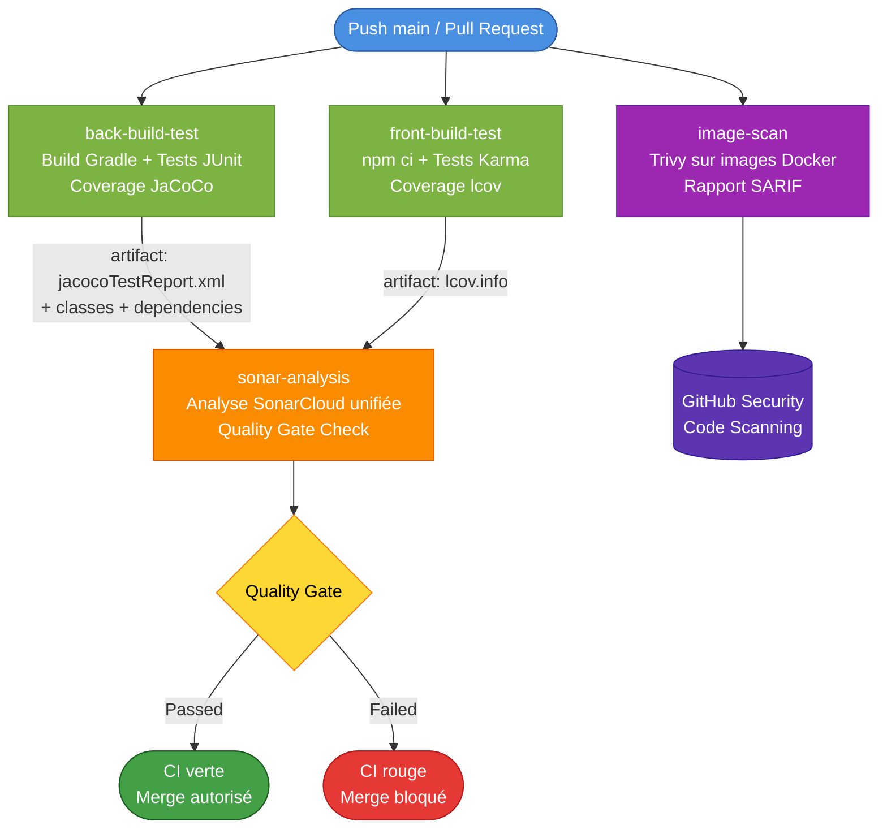

[](https://github.com/LaurentGourouvin/openclassrooms-project-9-micro-crm-orion/actions/workflows/ci.yml)
[](https://sonarcloud.io/summary/new_code?id=LaurentGourouvin_openclassrooms-project-9-micro-crm-orion)
[](https://sonarcloud.io/summary/new_code?id=LaurentGourouvin_openclassrooms-project-9-micro-crm-orion)
[](https://sonarcloud.io/summary/new_code?id=LaurentGourouvin_openclassrooms-project-9-micro-crm-orion)

<p align="center">
   
</p>

# MicroCRM

> P7 — Développeur Full-Stack Java et Angular  
> *Mettez en œuvre l'intégration et le déploiement continu d'une application Full-Stack*

MicroCRM est une application de démonstration servant de socle pour le module
P7 du parcours Développeur Full-Stack. C'est une implémentation simplifiée
d'un [CRM (Customer Relationship Management)](https://fr.wikipedia.org/wiki/Gestion_de_la_relation_client)
permettant la création, l'édition et la visualisation d'individus liés à des
organisations.


## Sommaire

- [Architecture du projet](#architecture-du-projet)
- [Démarrage rapide avec Docker](#démarrage-rapide-avec-docker)
- [Démarrer avec les sources](#démarrer-avec-les-sources)
- [Tests et qualité](#tests-et-qualité)
- [Pipeline CI/CD](#pipeline-cicd)
- [Stratégie de contribution](#stratégie-de-contribution)
- [Documentation technique](#documentation-technique)

## Architecture du projet

Ce [monorepo](https://en.wikipedia.org/wiki/Monorepo) contient les deux
composantes du projet :

- `back/` — Serveur Java Spring Boot 3 (API REST via Spring Data REST)
- `front/` — Client Angular 17 (TypeScript, Karma/Jasmine)

L'application est conteneurisée via un Dockerfile **multi-stage** unique,
orchestré par `docker-compose.yml`.

## Démarrage rapide avec Docker

C'est la méthode **recommandée** pour lancer l'application complète.

**Prérequis** : [Docker Desktop](https://www.docker.com/products/docker-desktop/)
(ou Docker Engine + Docker Compose).

```shell
docker compose up
```

Une fois les conteneurs démarrés :

- Front : http://localhost
- API : http://localhost:8080

Pour arrêter :

```shell
docker compose down
```

## Démarrer avec les sources

Si vous préférez lancer le projet sans Docker, voici comment procéder.

### Serveur

**Prérequis** : [OpenJDK 17](https://openjdk.org/)

```shell
cd back
./gradlew bootRun
```

L'API est disponible sur http://localhost:8080.

> Pour Windows, utilisez `gradlew.bat` à la place de `./gradlew`.

### Client

**Prérequis** : [Node.js 20](https://nodejs.org/) et npm

```shell
cd front
npm ci
npx @angular/cli serve
```

Le client est disponible sur http://localhost:4200.

## Tests et qualité

### Serveur

Tests JUnit + génération du rapport de coverage JaCoCo :

```shell
cd back
./gradlew build jacocoTestReport
```

Le rapport HTML est généré dans `back/build/reports/jacoco/test/html/`.

### Client

Tests Karma/Jasmine en mode headless avec coverage :

```shell
cd front
npm run test -- --code-coverage --watch=false --browsers=ChromeHeadlessNoSandbox
```

Le rapport HTML est généré dans `front/coverage/microcrm/`.

## Pipeline CI/CD

Le projet est industrialisé via un workflow **GitHub Actions** (`.github/workflows/ci.yml`)
qui s'exécute automatiquement sur chaque push sur `main` et chaque Pull Request.

### Architecture du pipeline



### Étapes principales

| Job | Rôle |
| --- | ---- |
| `back-build-test` | Compile le JAR Spring Boot, exécute les tests JUnit, génère le rapport JaCoCo |
| `front-build-test` | Installe les dépendances npm, exécute les tests Karma, génère le rapport lcov |
| `sonar-analysis` | Récupère les rapports via artifacts, lance une analyse SonarCloud unifiée, vérifie le Quality Gate |

La branche `main` est **protégée** : aucun merge n'est possible si la CI échoue
ou si le Quality Gate SonarCloud est KO.

> Pour les détails techniques (stratégie d'analyse Sonar, optimisations,
> sécurité de la chaîne d'approvisionnement), voir
> [`Exercices/Partie_2/plan_ci.md`](./Exercices/Partie_2/plan_ci.md).

## Stratégie de contribution

Le projet suit la stratégie **GitHub Flow** :

1. Créer une branche depuis `main` :
```shell
   git checkout -b feature/ma-fonctionnalite
```
2. Commiter et pousser
3. Ouvrir une Pull Request vers `main`
4. La CI valide automatiquement (build, tests, qualité)
5. Merger après validation

`main` est la seule branche long-lived. Elle est protégée et requiert :
- Une Pull Request validée
- Tous les checks CI verts
- Le Quality Gate SonarCloud passé

## Images Docker

Les images sont produites via un Dockerfile multi-stage. Trois cibles
(`targets`) sont disponibles : `front`, `back`, `standalone`.

### Construire et exécuter le front seul

```shell
docker build --target front -t orion-microcrm-front:latest .
docker run -it --rm -p 80:80 -p 443:443 orion-microcrm-front:latest
```

Disponible sur http://localhost.

### Construire et exécuter le back seul

```shell
docker build --target back -t orion-microcrm-back:latest .
docker run -it --rm -p 8080:8080 orion-microcrm-back:latest
```

Disponible sur http://localhost:8080.

### Image standalone (front + back combinés)

```shell
docker build --target standalone -t orion-microcrm-standalone:latest .
docker run -it --rm -p 8080:8080 -p 80:80 -p 443:443 orion-microcrm-standalone:latest
```

> ⚠️ La cible `standalone` regroupe les deux services dans un seul conteneur
> via Supervisor. Elle est utile pour des tests rapides mais déconseillée en
> production (viole le principe "un processus par conteneur"). Pour un
> déploiement réel, utiliser `docker compose up`.

## Documentation technique

La documentation détaillée du projet (analyses, plans, choix techniques) est
disponible dans [`Exercices/Partie_1/`](./Exercices/Partie_1/) et [`Exercices/Partie_2/`](./Exercices/Partie_2/):

- `front_analyse.md` — Analyse de l'application Angular
- `back_analyse.md` — Analyse de l'application Spring Boot
- `Dockerfile_analyse.md` — Audit du Dockerfile fourni
- `plan_testing.md` — Stratégie de tests automatisés
- `plan_security.md` — Plan de sécurité (SonarCloud, OWASP Top 10:2025)
- `plan_conteneurisation.md` — Plan de conteneurisation et déploiement
- `plan_ci.md` — Architecture détaillée du pipeline CI/CD